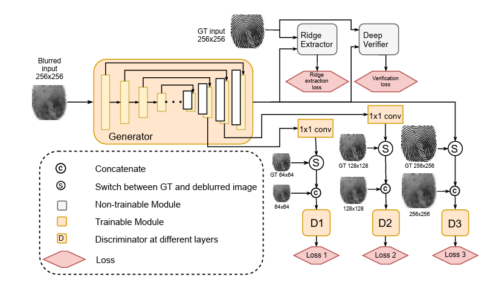
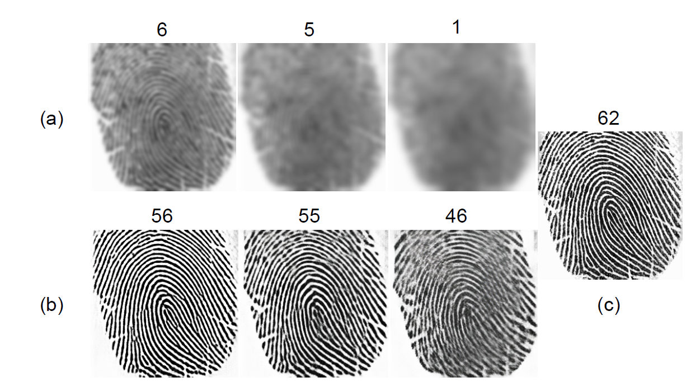
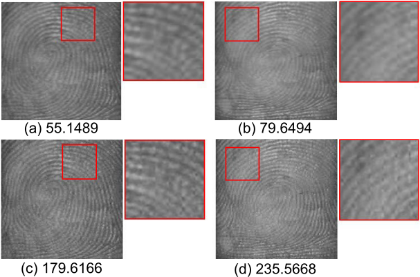
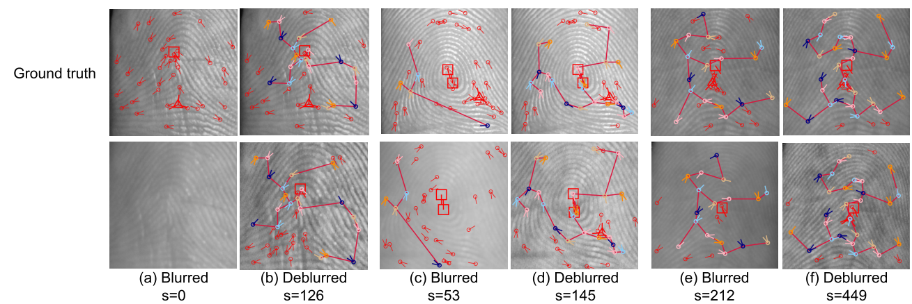

# Fingerphoto Deblurring

We provide PyTorch implementation for our Attention guided Multi-stage GAN.

**Fingerphoto-Deblurring:  [Project](https://github.com/ajoshi944/Fingerphoto-Deblurring) |  [Paper](https://arxiv.org/pdf/2106.11354) **






**Extended Version [Paper](https://ieeexplore.ieee.org/stamp/stamp.jsp?tp=&arnumber=10201840) **






## Getting Started

### Fingerphoto-Deblurring train/test
- To view training results and loss plots, run `python -m visdom.server` and click the URL http://localhost:8097.
- Train a model:
```bash
#!./scripts/train_model.sh
python train.py --dataroot ./datasets/dataset_name --name model_name --model pix2pix --direction BtoA
```
To see more intermediate results, check out  `./checkpoints/model_name/web/index.html`.

- Test the model (`bash ./scripts/test_model.sh`):
```bash
#!./scripts/test_model.sh
python test.py --dataroot ./datasets/dataset_name --name model_name --model pix2pix --direction BtoA
```
- The test results will be saved to a html file here: `./results/model_name/test_latest/index.html`.


## Citation
If you use this code for your research, please cite our papers.
```
@ARTICLE{10201840,
  author={Joshi, Amol S. and Dabouei, Ali and Dawson, Jeremy and Nasrabadi, Nasser M.},
  journal={IEEE Access}, 
  title={Fingerphoto Deblurring Using Attention-Guided Multi-Stage GAN}, 
  year={2023},
  volume={11},
  number={},
  pages={82709-82727},
  keywords={Fingerprint recognition;Generative adversarial networks;Cameras;Distortion;Generators;Biometrics (access control);Photography;Biometrics;contactless fingerprints;fingerphoto deblurring;generative adversarial networks;guided attention;multi-stage generative architecture},
  doi={10.1109/ACCESS.2023.3301467}}


@INPROCEEDINGS{9484406,
  author={Joshi, Amol S. and Dabouei, Ali and Dawson, Jeremy and Nasrabadi, Nasser M.},
  booktitle={2021 IEEE International Joint Conference on Biometrics (IJCB)}, 
  title={FDeblur-GAN: Fingerprint Deblurring using Generative Adversarial Network}, 
  year={2021},
  volume={},
  number={},
  pages={1-8},
  keywords={Image sensors;Databases;Image matching;Forensics;Fingerprint recognition;Generative adversarial networks;Sensor systems},
  doi={10.1109/IJCB52358.2021.9484406}}

```


## Acknowledgments
Our code is heavily borrowed from [pytorch-pix2pix](https://github.com/phillipi/pix2pix).
