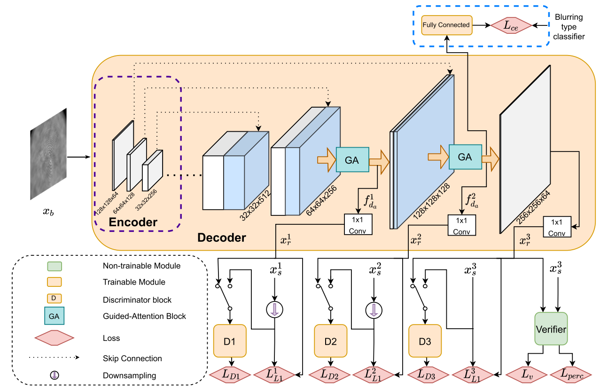

# Fingerphoto Deblurring

**Patent Pending Technology** - Application No. 18112701  

We provide PyTorch implementation for our Attention guided Multi-stage GAN.

Developed FDeblur-GAN, a multi-stage conditional GAN framework with integrated ridge extraction and ID-verification modules to restore blurred fingerprints from low-quality sensors and mobile captures. Leveraged synthetic data generation, deep feature preservation, and multi-scale discriminators to achieve 95.18% matching accuracy on deblurred samples, nearly matching clean fingerprint performance. Published in IJCB,21 and extended for a IEEE Access publication.

**Fingerphoto-Deblurring:  [Project](https://github.com/ajoshi944/Fingerphoto-Deblurring) |  [Paper](https://arxiv.org/pdf/2106.11354) **


---

## **Results**
| Model | Plain cGAN model | Proposed model  |
|-------|------------------|-----------------|
| EER ↓ | 0.1796           | 0.12            |
| AUC ↑ | 0.9090           | 0.9518          |


---

**Extended Version [Paper](https://ieeexplore.ieee.org/stamp/stamp.jsp?tp=&arnumber=10201840) **




---

## **Results**
| Metric | DeblurGAN v2 | Proposed Method |
|--------|--------------|-----------------|
| PSNR ↑ | 26.2646      | 30.4601         |
| SSIM ↑ | 0.8646       | 0.9474          |
| EER ↓  | 15.8576      | 5.8252          |
| AUC ↑  | 90.3908      | 98.7704         |

---

**Related Work: Best Student Paper Award at IJCB,24 [Paper](https://arxiv.org/pdf/2407.15964) **

## Citation
If you use this code for your research, please cite our papers.
```
@ARTICLE{10201840,
  author={Joshi, Amol S. and Dabouei, Ali and Dawson, Jeremy and Nasrabadi, Nasser M.},
  journal={IEEE Access}, 
  title={Fingerphoto Deblurring Using Attention-Guided Multi-Stage GAN}, 
  year={2023},
  volume={11},
  number={},
  pages={82709-82727},
  keywords={Fingerprint recognition;Generative adversarial networks;Cameras;Distortion;Generators;Biometrics (access control);Photography;Biometrics;contactless fingerprints;fingerphoto deblurring;generative adversarial networks;guided attention;multi-stage generative architecture},
  doi={10.1109/ACCESS.2023.3301467}}


@INPROCEEDINGS{9484406,
  author={Joshi, Amol S. and Dabouei, Ali and Dawson, Jeremy and Nasrabadi, Nasser M.},
  booktitle={2021 IEEE International Joint Conference on Biometrics (IJCB)}, 
  title={FDeblur-GAN: Fingerprint Deblurring using Generative Adversarial Network}, 
  year={2021},
  volume={},
  number={},
  pages={1-8},
  keywords={Image sensors;Databases;Image matching;Forensics;Fingerprint recognition;Generative adversarial networks;Sensor systems},
  doi={10.1109/IJCB52358.2021.9484406}}

```


## Acknowledgments
Our code is heavily borrowed from [pytorch-pix2pix](https://github.com/phillipi/pix2pix).
